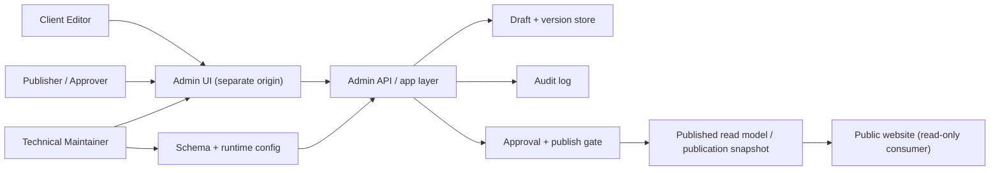

# Prompt 51 - Decoupled CMS Topology and Trust Boundaries

## Topology

The CMS is a separate write-side system from the public site.

## Write Path

1. An editor signs into the admin origin.
2. The editor changes only approved fields from the field registry.
3. The admin app writes a draft and audit entry.
4. A publisher reviews the diff.
5. The publisher either:
   - rejects the draft
   - approves and publishes it
   - reverts to a prior published version

## Publish Path

Publishing must not expose draft content directly to the public website.

Required boundary:

- draft data lives behind admin auth
- the public site consumes only published records
- publish creates or updates a stable published read model
- rollback can revert content independently of the broader public-site code release

## Read Path

The public site remains read-only:

- no public browser can call a write endpoint
- no public page can mutate draft or published CMS state
- the public site receives published content only
- public templates still decide layout, structure, and component composition

## Rollback Path

Two rollback paths must remain distinct:

1. **content rollback**
   - revert a published editorial change without rolling back public code
2. **runtime rollback**
   - revert a public-site or admin runtime release

Prompt 55 should preserve that separation in deployment architecture.

## Trust Boundaries

### Public site boundary

The public site:

- has no editor authentication
- exposes no write APIs for content mutation
- renders only approved published content
- keeps analytics, security, and deployment settings code-owned

### Admin boundary

The admin origin must isolate:

- authentication
- sessions
- secrets
- draft content
- approval state
- audit history
- publishing controls

### Content boundary

The publication contract must prevent CMS scope drift into:

- component trees
- layout wiring
- design system tokens
- frontend code
- server-side runtime configuration

## Why The Separate Origin Matters

Prompt 51 explicitly rejects an embedded admin surface inside the public site because that would blur:

- auth boundaries
- CSP and session assumptions
- observability
- rollback paths
- incident handling

The admin system may share repositories or internal models later, but it must not share the public trust boundary.
